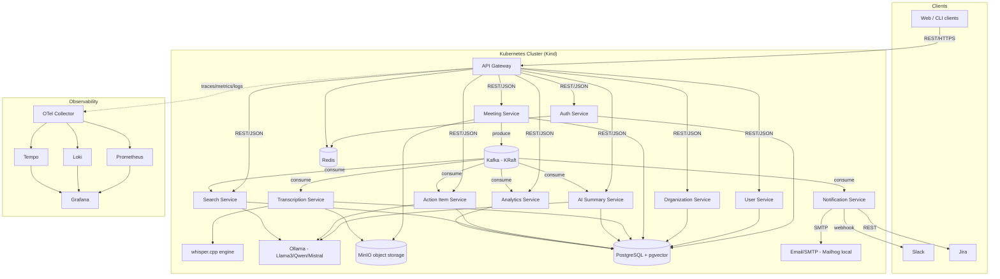

# AI Workplace Operating System — Meeting Intelligence Platform

**Master plan.** This document is the entry point. It gives the executive summary,
the high-level architecture, the key design decisions (and their trade-offs), and
an index into the detailed design documents. Everything is scoped to run **free,
local, and open-source** on a MacBook via Docker + Kind, with a straight upgrade
path to a real cloud/K8s cluster.

## Document Index

| Doc | Contents |
|---|---|
| [`architecture/microservices.md`](architecture/microservices.md) | LLD for all 11 services: responsibilities, REST APIs, DB schema, Kafka topics, scaling |
| [`architecture/database-schema.md`](architecture/database-schema.md) | Full multi-tenant PostgreSQL + pgvector DDL |
| [`architecture/kafka-topics.md`](architecture/kafka-topics.md) | Topic catalog, partitioning/keying, retention, event-flow sequence diagrams |
| [`architecture/api-spec.md`](architecture/api-spec.md) | REST API specification — external and internal calls are the same contract, documented once, no separate gRPC layer |
| [`architecture/kubernetes-cicd.md`](architecture/kubernetes-cicd.md) | K8s deployment strategy, Helm chart layout, GitHub Actions, ArgoCD GitOps |
| [`architecture/observability-security.md`](architecture/observability-security.md) | Metrics/logs/traces, security architecture, multi-tenancy, DR, cost optimization |
| [`architecture/folder-structure.md`](architecture/folder-structure.md) | Go monorepo layout |
| [`architecture/deployment-demo-strategy.md`](architecture/deployment-demo-strategy.md) | Client strategy (web app vs. extension/desktop/mobile), public resume-demo hosting plan, mock-Jira-by-default ticket provider design |
| [`ROADMAP.md`](ROADMAP.md) | 7-phase implementation roadmap with tasks, deliverables, learning outcomes, interview topics |

## 1. Executive Summary

Build a multi-tenant SaaS platform that ingests meeting recordings, transcribes
them locally (Whisper), extracts structured knowledge (summaries, decisions,
risks, blockers, action items with owners) with local LLMs (Ollama), indexes
everything for semantic search and RAG Q&A (pgvector), automates downstream
work (Jira tickets, Slack/email notifications, reminders), and surfaces
cross-meeting analytics — all built as independently deployable Go
microservices on Kubernetes, wired together with Kafka, observed with the
Prometheus/Grafana/Loki/Tempo/OTel stack, and shipped via GitHub Actions +
ArgoCD GitOps.

The project doubles as a **Staff/Senior backend interview portfolio piece**:
every phase is chosen to exercise a canonical distributed-systems topic
(event-driven architecture, exactly-once-ish processing, multi-tenant data
isolation, CQRS-ish read models for analytics, autoscaling on queue depth,
GitOps, chaos/DR).

## 2. High-Level Architecture

## 3. Tech Stack (final decisions)

| Layer | Choice | Notes |
|---|---|---|
| Language | Go 1.23+ | All services, workspace (`go.work`) monorepo |
| HTTP framework | Fiber, standardized across every service (gateway and internal) | One framework, one middleware chain to learn/instrument, whether the caller is the browser or another service |
| Internal communication | REST/JSON over HTTP — same transport as the external API, no gRPC | See `microservices.md` §"Internal Communication" for the reasoning and trade-off |
| External API | REST (hand-written, OpenAPI 3.1 spec maintained alongside it for docs/codegen) | Gateway reverse-proxies straight through to each service's REST routes — no protocol translation |
| Primary DB | PostgreSQL 16 + `pgvector` | One cluster, **schema-per-service** logical isolation (see §5 trade-off) |
| Cache | Redis 7 | Sessions, rate limiting, hot reads, idempotency keys |
| Message bus | Apache Kafka (KRaft, no ZooKeeper) via Strimzi operator | Event-driven backbone |
| Object storage | MinIO | S3-compatible, holds raw recordings + exports |
| ASR | whisper.cpp (CPU, GGML quantized models) | Called via whisper.cpp's built-in HTTP server; Faster-Whisper documented as GPU/Python alt |
| LLM runtime | Ollama | Serves Llama 3 8B / Qwen2.5 7B / Mistral 7B, all Q4_K_M quantized |
| Embeddings | Ollama `nomic-embed-text` (768-dim) | Stored in `pgvector` |
| Orchestration | Kubernetes (Kind, 1 control-plane + 2 workers) | Local; portable to EKS/GKE later |
| Packaging | Helm (umbrella chart + per-service subcharts) | |
| GitOps | ArgoCD, app-of-apps via `ApplicationSet` | |
| CI | GitHub Actions | lint → test → build → scan → push GHCR → bump chart values |
| Metrics | Prometheus + kube-state-metrics + node-exporter | |
| Dashboards/alerts | Grafana + Alertmanager | |
| Logs | Loki + Promtail (or OTel log exporter) | |
| Traces | Tempo, OTel SDK (Go), OTel Collector | |
| Auth | JWT (access 15m + rotating refresh), bcrypt/argon2 password hashing | |
| Multi-tenancy | `org_id` on every row + Postgres Row-Level Security | |

Everything above has a fully free/open-source local footprint — no paid API keys, no managed cloud services required.

## 4. Microservices at a Glance

| # | Service | Core Responsibility |
|---|---|---|
| 1 | API Gateway | AuthN edge, routing, rate limiting, reverse-proxying REST to internal services |
| 2 | Auth Service | Signup/login, JWT issuance/rotation, password reset |
| 3 | User Service | User profiles, org membership, RBAC role assignment |
| 4 | Organization Service | Tenant lifecycle, plans/quotas, org settings |
| 5 | Meeting Service | Upload, metadata, lifecycle/status, MinIO orchestration |
| 6 | Transcription Service | whisper.cpp pipeline, transcript + speaker segments |
| 7 | AI Summary Service | Chunking + summarization pipeline via Ollama |
| 8 | Action Item Service | Action/decision/risk/blocker extraction, owner assignment, status tracking |
| 9 | Search Service | Embedding pipeline, semantic search, RAG Q&A, citations |
| 10 | Notification Service | Slack, Email, Jira ticket creation, reminder scheduler |
| 11 | Analytics Service | Cross-meeting trend/productivity aggregates (event-sourced read models) |

Full LLD for each is in [`architecture/microservices.md`](architecture/microservices.md).

## 5. Key Design Decisions & Trade-offs (interview-relevant)

- **Schema-per-service in one Postgres cluster, not DB-per-service.** True
  physical DB-per-service is the "correct" microservices pattern, but it multiplies
  operational cost on a laptop (11 Postgres instances) for no real local benefit.
  We use one PG cluster with one schema per service (`auth.*`, `meeting.*`,
  `search.*`, …), each service owns and migrates only its schema, and no service
  ever queries another's tables directly (only via its API/events). This keeps
  the migration path to real DB-per-service a schema-extraction exercise, not a
  rewrite — a good thing to discuss in an interview.
- **No gRPC — REST/JSON for both external and internal calls.** Considered
  gRPC for service-to-service traffic (the original plan), but for this
  project's actual scale — a handful of synchronous internal calls, no
  polyglot clients, no streaming requirement — one HTTP/JSON stack end to
  end is simpler to build, test, and debug than two transports, at the cost
  of losing compile-time contract checking. Kafka message payloads are
  plain versioned JSON (documented per-topic in `kafka-topics.md`), not
  generated from any schema file. Full reasoning in `microservices.md`
  §"Internal Communication."
- **Reminders via a poll-based scheduler**, not Kafka native delay (Kafka has
  none). A `notification.action_item_reminders` table with `due_at` is polled
  every minute by Notification Service and emits `action-item.reminder-due.v1`.
  Simple, durable, horizontally-safe with a Postgres advisory lock to avoid
  double-fire under multiple replicas.
- **Tenant isolation defense-in-depth**: JWT carries `org_id`; HTTP
  middleware injects it into request context; repository layer sets
  `SET LOCAL app.current_org = $org_id` per transaction; Postgres RLS policies
  enforce it at the row level even if application code has a bug. MinIO objects
  are always keyed `org_id/meeting_id/...` and served via short-lived presigned
  URLs, never public buckets.
- **CPU-only local AI stack**: whisper.cpp `small`/`base` models and Q4_K_M
  quantized 7-8B LLMs are the default so the whole thing runs on a MacBook
  without a GPU. Larger models / GPU acceleration are called out as prod
  upgrades, not requirements.
- **pgvector over a dedicated vector database** (Pinecone/Weaviate/Milvus/
  Qdrant): the vectors live next to relational data that's in Postgres
  anyway, and pgvector avoids a second stateful system with its own
  multi-tenancy and backup story, at the cost of not scaling as far as a
  purpose-built vector DB would past tens of millions of vectors. Full
  comparison in `architecture/database-schema.md` §"Why pgvector".
- **RBAC is staged, not built all at once**: Phase 1 ships only `owner`/
  `member` (whoever signs up is the owner; there's no invite flow yet, so
  there's nothing to assign a second role to). The full 5-role matrix,
  invites, and role management land in Phase 2, once there's an actual
  second org member to manage. See `ROADMAP.md` Phase 1/2 and
  `architecture/api-spec.md` §Users.
- **The REST API is entirely hand-written**, external and internal alike —
  no protobuf, no `protoc-gen-openapiv2`, no generated stubs anywhere.
  `openapi.yaml` is maintained by hand as documentation/client-codegen
  tooling, not as a source of truth the handlers are generated from — full
  reasoning in `architecture/api-spec.md`.
- **Ticket creation is provider-agnostic** (`TicketProvider` interface in
  Notification Service). The shipped default is a self-built **mock Jira**
  board — the public demo org uses it so a stranger clicking the resume
  link sees a full "meeting → action item → ticket" loop with no Jira
  account required. A real Atlassian Jira Cloud provider is implemented
  behind the same interface for interview screen-shares. See
  `architecture/deployment-demo-strategy.md` §3.
- **Reference architecture vs. public demo are deliberately different
  deployments.** The K8s/Kafka/ArgoCD/KEDA stack is what's built, run
  locally on Kind, and demonstrated via docs + a recorded walkthrough; the
  public resume link runs a cost-trimmed single-VM `docker compose`
  deployment (Oracle Cloud Free Tier) behind a Cloudflare Tunnel. See
  `architecture/deployment-demo-strategy.md` §2.
- **KEDA is proposed (Phase 5/6) over plain HPA** for the Kafka-consumer
  services (Transcription, AI Summary, Action Item, Search) so replica count
  scales on **consumer-group lag**, not CPU — the correct signal for
  queue-driven workloads, and a strong interview topic.

## 6. Non-Functional Targets

| Attribute | Target (local dev cluster) |
|---|---|
| Availability | 2+ replicas per stateless service, PodDisruptionBudgets, readiness/liveness probes |
| Scalability | Horizontal via HPA/KEDA; stateless services scale independently of AI workers |
| Fault tolerance | Kafka consumer retries + DLQ per topic; circuit breaker around Ollama/whisper.cpp calls |
| Tracing | End-to-end trace_id propagated HTTP → HTTP → Kafka headers → consumer |
| Security | TLS at ingress, JWT + RBAC, RLS multi-tenancy, secrets never in git (SOPS+age) |
| DR | Postgres WAL archiving to MinIO, nightly logical dumps, documented restore runbook |
