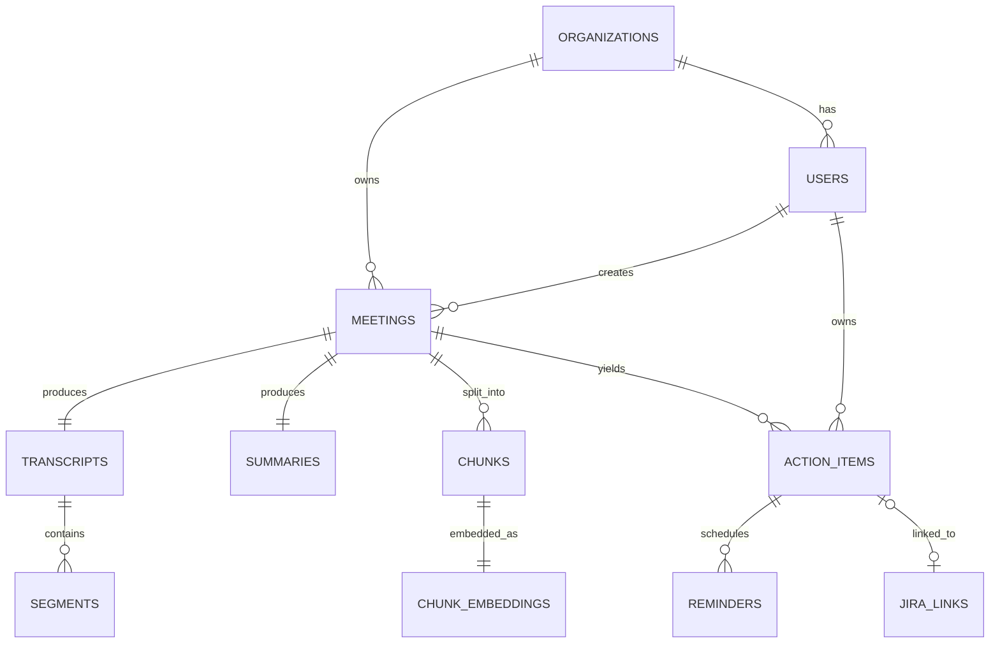

# Database Schema Design

One PostgreSQL 16 cluster (`pgvector` extension enabled), **one schema per
service** for logical isolation, **multi-tenant row-level isolation** via
`org_id` + Postgres Row-Level Security on every tenant-owned table. Each
service owns migrations for its own schema only (`golang-migrate`, directory
per service under `migrations/<service>/`).

## Conventions

- Every tenant-scoped table has `org_id UUID NOT NULL` and an RLS policy.
- Primary keys are `UUID DEFAULT gen_random_uuid()` (via `pgcrypto`).
- `created_at`/`updated_at` are `TIMESTAMPTZ NOT NULL DEFAULT now()`, updated
  via a shared `set_updated_at()` trigger.
- Foreign keys **do not** cross schema boundaries (microservice DB
  independence) — cross-service references are UUIDs validated at the
  application layer, not enforced by FK constraint. Concretely: `user.users`
  has an `org_id` column but **no** `REFERENCES org.organizations(id)` — a
  real FK there would mean User Service's schema physically depends on
  Organization Service's table existing and being migrated first, which is
  exactly the coupling that schema-per-service is meant to avoid. Same
  reasoning for `auth.credentials.user_id` not referencing `user.users.id`.
  The trade-off: Postgres can no longer catch an orphaned `org_id` for you
  — each service validates the ID it was handed (e.g. via a gRPC call to
  Organization Service, or by trusting the JWT it came from) instead of
  the database rejecting the insert.
- **Uniqueness**: `id` is a `UUID PRIMARY KEY` — globally unique across the
  *entire* table, not just within one org; two different orgs' users never
  collide on `id` by construction (a random 122-bit UUID), so there's no
  need for a composite key like `(org_id, id)`. What *is* scoped to the
  org is `email` — `UNIQUE (org_id, email)` means the same email address
  can exist as a *separate* user row in two different orgs (deliberate: an
  org membership is its own account here, not a shared global identity —
  see the note on this trade-off below the `user.users` table).

## Row-Level Security pattern (applied per tenant table)

```sql
ALTER TABLE meeting.meetings ENABLE ROW LEVEL SECURITY;
CREATE POLICY tenant_isolation ON meeting.meetings
  USING (org_id = current_setting('app.current_org', true)::uuid);
```
Read this as two separate statements:
1. `ENABLE ROW LEVEL SECURITY` turns off Postgres's default behavior (any
   query sees every row) for this table — from here on, **every** `SELECT`/
   `UPDATE`/`DELETE` against `meeting.meetings` is silently filtered by
   whatever policies exist, for every role except the table owner/superuser.
2. `CREATE POLICY ... USING (...)` is the filter itself: it's appended to
   every query as an implicit `WHERE`, equivalent to Postgres rewriting
   `SELECT * FROM meeting.meetings` into
   `SELECT * FROM meeting.meetings WHERE org_id = current_setting('app.current_org', true)::uuid`
   automatically, no matter what the application code actually wrote.
   `current_setting('app.current_org', true)` reads a session-local
   variable (the `true` second argument means "return NULL instead of
   erroring if it's unset" — that NULL then matches no `org_id`, so an
   unset context fails closed to zero rows, not all rows).

Every request-scoped DB transaction begins with:
```sql
SET LOCAL app.current_org = '<org_id from JWT>';
```
issued by a shared repository middleware in `internal/platform/db`, so
forgetting it fails closed (no rows visible) rather than open. This is what
makes RLS a second, independent line of defense: even if a handler bug lets
a request through without an application-layer org check, the database
itself will not return another tenant's rows.

## Extensions

```sql
CREATE EXTENSION IF NOT EXISTS pgcrypto;
CREATE EXTENSION IF NOT EXISTS vector;   -- pgvector
CREATE EXTENSION IF NOT EXISTS citext;
```

## Why pgvector (and not a dedicated vector database)

| Option | What it is | Why not chosen here |
|---|---|---|
| **pgvector** (chosen) | A Postgres extension adding a `vector` column type + ANN indexes (IVFFlat, HNSW) | — |
| Pinecone | Managed, proprietary vector DB | Paid SaaS, violates the "no paid cloud services" constraint outright |
| Weaviate / Milvus / Qdrant | Self-hostable, open-source, purpose-built vector DBs | Free to run, but each is *another stateful service* to deploy, operate, back up, and secure (its own auth, its own multi-tenancy story) on top of everything already in the stack — real operational cost on a laptop for a benefit that only shows up past tens of millions of vectors |
| Elasticsearch/OpenSearch (k-NN plugin) | Search engine with vector search bolted on | Heavier resource footprint (JVM) than Postgres for a feature we'd only use narrowly; better if full-text search were the primary need, which it isn't here |
| Chroma | Lightweight embedded vector store | Great for a prototype script, not built for multi-tenant RLS, concurrent writers, or the durability guarantees the rest of the app already gets from Postgres |

**The actual reasoning**: this project's vectors (chunk embeddings) *live
next to*, and are always queried *together with*, ordinary relational data
that already has to be in Postgres anyway (`org_id`, `meeting_id`, tenant
isolation, transactional writes alongside the chunk row itself). pgvector
means:
- **One database to run, back up, and secure**, not two — no second
  stateful system with its own multi-tenancy model to reinvent (Postgres
  RLS just applies to `search.chunk_embeddings` like any other table, see
  the `search` schema below).
- **Transactional consistency** — a chunk's text row and its embedding can
  be written in the same transaction as a normal Postgres `INSERT`; with a
  separate vector DB you'd have a distributed dual-write problem (write to
  Postgres, then write to Pinecone/Weaviate, and handle the case where one
  succeeds and the other doesn't).
- **Good enough performance at this project's actual scale.** An HNSW
  index in pgvector comfortably handles low-single-digit millions of
  vectors with sub-50ms queries — far beyond what a portfolio project (or
  most real per-tenant SaaS workloads) will ever hold. Dedicated vector DBs
  win at a scale (tens/hundreds of millions of vectors, need for
  distributed sharding across many nodes) this system isn't built for.
- **$0 and one less thing to learn to operate**, matching the project's
  hard constraint of free, local, Docker/K8s-only infrastructure.

The honest trade-off to be able to state in an interview: if this were a
company with 500M+ chunks across all tenants and sub-10ms p99 latency
requirements at that scale, a dedicated vector DB (Qdrant is a reasonable
pick — open-source, good filtering support, straightforward to self-host)
would win. pgvector is the right choice for this system's actual scale and
constraints, not the right choice unconditionally — knowing where the
crossover point is matters more than picking either one dogmatically.

## Schemas & Tables

### `org` — Organization Service
```sql
CREATE SCHEMA org;

CREATE TABLE org.organizations (
  id UUID PRIMARY KEY DEFAULT gen_random_uuid(),
  name TEXT NOT NULL,
  slug TEXT NOT NULL UNIQUE,
  plan TEXT NOT NULL DEFAULT 'free',
  status TEXT NOT NULL DEFAULT 'active' CHECK (status IN ('active','suspended','deleted')),
  created_at TIMESTAMPTZ NOT NULL DEFAULT now()
);

CREATE TABLE org.quotas (
  org_id UUID PRIMARY KEY REFERENCES org.organizations(id),
  max_users INT NOT NULL DEFAULT 10,
  max_minutes_per_month INT NOT NULL DEFAULT 1000,
  retention_days INT NOT NULL DEFAULT 365,
  used_minutes_this_month INT NOT NULL DEFAULT 0
);

CREATE TABLE org.integration_configs (
  org_id UUID PRIMARY KEY REFERENCES org.organizations(id),
  slack_webhook_url TEXT,
  jira_base_url TEXT,
  jira_project_key TEXT,
  jira_api_token_secret_ref TEXT,
  smtp_config_secret_ref TEXT
);
```

### `user` — User Service
```sql
CREATE SCHEMA "user";

CREATE TABLE "user".users (
  id UUID PRIMARY KEY DEFAULT gen_random_uuid(),
  org_id UUID NOT NULL,
  email CITEXT NOT NULL,
  name TEXT NOT NULL,
  role TEXT NOT NULL CHECK (role IN ('owner','admin','manager','member','viewer')),
  status TEXT NOT NULL DEFAULT 'invited' CHECK (status IN ('invited','active','deactivated')),
  avatar_url TEXT,
  created_at TIMESTAMPTZ NOT NULL DEFAULT now(),
  updated_at TIMESTAMPTZ NOT NULL DEFAULT now(),
  UNIQUE (org_id, email)
);
ALTER TABLE "user".users ENABLE ROW LEVEL SECURITY;
CREATE POLICY tenant_isolation ON "user".users
  USING (org_id = current_setting('app.current_org', true)::uuid);
```
**Identity model trade-off**: `email` is unique per-org (`UNIQUE (org_id,
email)`), not globally. That means `alice@co.com` in Org A and
`alice@co.com` in Org B are two separate `user.users` rows with two
separate `id`s, two separate passwords in `auth.credentials`, and no
shared login — this project's "org membership = account" model, which is
simple and matches Phase 1's scope (one org per signup). The alternative
some real SaaS products use is a **global identity table** (`identity.people`
keyed by email, one row per human) plus a separate `org_memberships(org_id,
person_id, role)` join table, so one login can belong to several orgs and
switch between them. That's a legitimate upgrade path if multi-org
membership becomes a real requirement later — it's a schema addition
(a join table + a foreign key from `auth.credentials` to the identity
table instead of directly to an org-scoped user row), not a rewrite,
precisely because `id` is already a stable, globally-unique UUID rather
than something derived from `org_id`.
```sql

CREATE TABLE "user".invites (
  id UUID PRIMARY KEY DEFAULT gen_random_uuid(),
  org_id UUID NOT NULL,
  email CITEXT NOT NULL,
  role TEXT NOT NULL,
  token_hash TEXT NOT NULL,
  invited_by UUID NOT NULL,
  expires_at TIMESTAMPTZ NOT NULL,
  accepted_at TIMESTAMPTZ
);
```

### `auth` — Auth Service
```sql
CREATE SCHEMA auth;

CREATE TABLE auth.credentials (
  user_id UUID PRIMARY KEY,
  org_id UUID NOT NULL,
  password_hash TEXT NOT NULL,
  algo TEXT NOT NULL DEFAULT 'argon2id',
  failed_attempts INT NOT NULL DEFAULT 0,
  locked_until TIMESTAMPTZ,
  updated_at TIMESTAMPTZ NOT NULL DEFAULT now()
);

CREATE TABLE auth.refresh_tokens (
  id UUID PRIMARY KEY DEFAULT gen_random_uuid(),
  user_id UUID NOT NULL,
  org_id UUID NOT NULL,
  token_hash TEXT NOT NULL,
  issued_at TIMESTAMPTZ NOT NULL DEFAULT now(),
  expires_at TIMESTAMPTZ NOT NULL,
  revoked_at TIMESTAMPTZ,
  replaced_by UUID,
  user_agent TEXT,
  ip INET
);
-- Partial index: only indexes rows where revoked_at IS NULL (i.e. still-active
-- tokens). This is a "find this user's live refresh token(s)" lookup that
-- runs on every /auth/refresh and /auth/logout call, so it needs to be fast;
-- it's deliberately *not* an index over all refresh_tokens, because most
-- rows in this table are historical (expired or revoked) and irrelevant to
-- that query — indexing them too would waste space and slow down every
-- INSERT/UPDATE on the table for rows this query will never match anyway.
CREATE INDEX ON auth.refresh_tokens (user_id) WHERE revoked_at IS NULL;

CREATE TABLE auth.password_reset_tokens (
  id UUID PRIMARY KEY DEFAULT gen_random_uuid(),
  user_id UUID NOT NULL,
  token_hash TEXT NOT NULL,
  expires_at TIMESTAMPTZ NOT NULL,
  used_at TIMESTAMPTZ
);
```

### `meeting` — Meeting Service
```sql
CREATE SCHEMA meeting;

CREATE TABLE meeting.meetings (
  id UUID PRIMARY KEY DEFAULT gen_random_uuid(),
  org_id UUID NOT NULL,
  title TEXT NOT NULL,
  created_by UUID NOT NULL,
  status TEXT NOT NULL DEFAULT 'uploaded' CHECK (status IN
    ('uploaded','transcribing','transcribed','summarizing','summarized',
     'completed','failed')),
  source_type TEXT NOT NULL DEFAULT 'upload' CHECK (source_type IN
    ('upload','zoom_import','teams_import')),
  recording_object_key TEXT NOT NULL,
  duration_seconds INT,
  started_at TIMESTAMPTZ,
  created_at TIMESTAMPTZ NOT NULL DEFAULT now(),
  updated_at TIMESTAMPTZ NOT NULL DEFAULT now()
);
ALTER TABLE meeting.meetings ENABLE ROW LEVEL SECURITY;
CREATE POLICY tenant_isolation ON meeting.meetings
  USING (org_id = current_setting('app.current_org', true)::uuid);
CREATE INDEX ON meeting.meetings (org_id, created_at DESC);

CREATE TABLE meeting.participants (
  meeting_id UUID NOT NULL REFERENCES meeting.meetings(id) ON DELETE CASCADE,
  user_id UUID,
  email TEXT NOT NULL,
  display_name TEXT,
  PRIMARY KEY (meeting_id, email)
);

CREATE TABLE meeting.status_history (
  id BIGSERIAL PRIMARY KEY,
  meeting_id UUID NOT NULL REFERENCES meeting.meetings(id) ON DELETE CASCADE,
  status TEXT NOT NULL,
  changed_at TIMESTAMPTZ NOT NULL DEFAULT now(),
  note TEXT
);
```

### `transcription` — Transcription Service
```sql
CREATE SCHEMA transcription;

CREATE TABLE transcription.transcripts (
  id UUID PRIMARY KEY DEFAULT gen_random_uuid(),
  meeting_id UUID NOT NULL,
  org_id UUID NOT NULL,
  language TEXT,
  engine TEXT NOT NULL DEFAULT 'whisper.cpp',
  model_name TEXT NOT NULL,
  status TEXT NOT NULL DEFAULT 'processing',
  raw_text TEXT,
  word_count INT,
  created_at TIMESTAMPTZ NOT NULL DEFAULT now()
);
ALTER TABLE transcription.transcripts ENABLE ROW LEVEL SECURITY;
CREATE POLICY tenant_isolation ON transcription.transcripts
  USING (org_id = current_setting('app.current_org', true)::uuid);

CREATE TABLE transcription.segments (
  id BIGSERIAL PRIMARY KEY,
  transcript_id UUID NOT NULL REFERENCES transcription.transcripts(id) ON DELETE CASCADE,
  speaker_label TEXT,
  start_ms INT NOT NULL,
  end_ms INT NOT NULL,
  text TEXT NOT NULL,
  confidence REAL
);
CREATE INDEX ON transcription.segments (transcript_id, start_ms);
```

### `ai` — AI Summary Service
```sql
CREATE SCHEMA ai;

CREATE TABLE ai.summaries (
  id UUID PRIMARY KEY DEFAULT gen_random_uuid(),
  meeting_id UUID NOT NULL,
  org_id UUID NOT NULL,
  summary_text TEXT NOT NULL,
  key_decisions JSONB NOT NULL DEFAULT '[]',
  risks JSONB NOT NULL DEFAULT '[]',
  blockers JSONB NOT NULL DEFAULT '[]',
  model_used TEXT NOT NULL,
  prompt_version TEXT NOT NULL,
  created_at TIMESTAMPTZ NOT NULL DEFAULT now()
);
ALTER TABLE ai.summaries ENABLE ROW LEVEL SECURITY;
CREATE POLICY tenant_isolation ON ai.summaries
  USING (org_id = current_setting('app.current_org', true)::uuid);

CREATE TABLE ai.chunks (
  id UUID PRIMARY KEY DEFAULT gen_random_uuid(),
  meeting_id UUID NOT NULL,
  org_id UUID NOT NULL,
  chunk_index INT NOT NULL,
  text TEXT NOT NULL,
  token_count INT NOT NULL,
  start_ms INT,
  end_ms INT,
  created_at TIMESTAMPTZ NOT NULL DEFAULT now()
);
CREATE INDEX ON ai.chunks (meeting_id, chunk_index);
```

### `actionitem` — Action Item Service
```sql
CREATE SCHEMA actionitem;

CREATE TABLE actionitem.action_items (
  id UUID PRIMARY KEY DEFAULT gen_random_uuid(),
  meeting_id UUID NOT NULL,
  org_id UUID NOT NULL,
  description TEXT NOT NULL,
  type TEXT NOT NULL CHECK (type IN ('action','decision','risk','blocker')),
  owner_user_id UUID,
  owner_raw_name TEXT,
  due_date DATE,
  status TEXT NOT NULL DEFAULT 'open' CHECK (status IN ('open','in_progress','done','cancelled')),
  priority TEXT NOT NULL DEFAULT 'medium' CHECK (priority IN ('low','medium','high')),
  jira_issue_key TEXT,
  extracted_from_chunk_id UUID,
  confidence REAL,
  created_at TIMESTAMPTZ NOT NULL DEFAULT now(),
  updated_at TIMESTAMPTZ NOT NULL DEFAULT now()
);
ALTER TABLE actionitem.action_items ENABLE ROW LEVEL SECURITY;
CREATE POLICY tenant_isolation ON actionitem.action_items
  USING (org_id = current_setting('app.current_org', true)::uuid);
CREATE INDEX ON actionitem.action_items (org_id, owner_user_id, status);

CREATE TABLE actionitem.reminders (
  id UUID PRIMARY KEY DEFAULT gen_random_uuid(),
  action_item_id UUID NOT NULL REFERENCES actionitem.action_items(id) ON DELETE CASCADE,
  remind_at TIMESTAMPTZ NOT NULL,
  sent_at TIMESTAMPTZ,
  channel TEXT NOT NULL DEFAULT 'slack'
);
CREATE INDEX ON actionitem.reminders (remind_at) WHERE sent_at IS NULL;
```

### `search` — Search Service (RAG / pgvector)
```sql
CREATE SCHEMA search;

CREATE TABLE search.chunk_embeddings (
  chunk_id UUID PRIMARY KEY,
  meeting_id UUID NOT NULL,
  org_id UUID NOT NULL,
  embedding VECTOR(768) NOT NULL,
  model_name TEXT NOT NULL,
  created_at TIMESTAMPTZ NOT NULL DEFAULT now()
);
ALTER TABLE search.chunk_embeddings ENABLE ROW LEVEL SECURITY;
CREATE POLICY tenant_isolation ON search.chunk_embeddings
  USING (org_id = current_setting('app.current_org', true)::uuid);

-- HNSW index for cosine similarity (pgvector >= 0.5)
CREATE INDEX chunk_embeddings_hnsw_idx ON search.chunk_embeddings
  USING hnsw (embedding vector_cosine_ops);

CREATE TABLE search.qa_history (
  id UUID PRIMARY KEY DEFAULT gen_random_uuid(),
  org_id UUID NOT NULL,
  user_id UUID NOT NULL,
  question TEXT NOT NULL,
  answer TEXT NOT NULL,
  cited_chunk_ids UUID[] NOT NULL DEFAULT '{}',
  created_at TIMESTAMPTZ NOT NULL DEFAULT now()
);
```

### `notification` — Notification Service
```sql
CREATE SCHEMA notification;

CREATE TABLE notification.outbox (
  id UUID PRIMARY KEY DEFAULT gen_random_uuid(),
  org_id UUID NOT NULL,
  channel TEXT NOT NULL CHECK (channel IN ('slack','email','jira')),
  payload JSONB NOT NULL,
  status TEXT NOT NULL DEFAULT 'pending' CHECK (status IN ('pending','sent','failed')),
  attempts INT NOT NULL DEFAULT 0,
  last_error TEXT,
  created_at TIMESTAMPTZ NOT NULL DEFAULT now(),
  sent_at TIMESTAMPTZ
);
CREATE INDEX ON notification.outbox (status, created_at) WHERE status = 'pending';

-- Links an action item to whichever ticket provider created a ticket for
-- it. 'mock_jira' is the default (used by the public demo org); 'atlassian_jira'
-- is the optional real-Jira-Cloud path. See deployment-demo-strategy.md §3.
CREATE TABLE notification.jira_links (
  action_item_id UUID PRIMARY KEY,
  org_id UUID NOT NULL,
  provider TEXT NOT NULL DEFAULT 'mock_jira'
    CHECK (provider IN ('mock_jira', 'atlassian_jira')),
  jira_issue_key TEXT NOT NULL,
  jira_url TEXT NOT NULL,
  created_at TIMESTAMPTZ NOT NULL DEFAULT now()
);

-- Backing store for the self-built mock Jira board (the default ticket
-- provider). Rendered read-only and public at GET /demo/board.
CREATE TABLE notification.mock_jira_issues (
  id UUID PRIMARY KEY DEFAULT gen_random_uuid(),
  org_id UUID NOT NULL,
  action_item_id UUID NOT NULL,
  issue_key TEXT NOT NULL,          -- e.g. "DEMO-142"
  project_key TEXT NOT NULL DEFAULT 'DEMO',
  title TEXT NOT NULL,
  status TEXT NOT NULL DEFAULT 'To Do'
    CHECK (status IN ('To Do', 'In Progress', 'Done')),
  created_at TIMESTAMPTZ NOT NULL DEFAULT now(),
  updated_at TIMESTAMPTZ NOT NULL DEFAULT now()
);
CREATE UNIQUE INDEX ON notification.mock_jira_issues (org_id, issue_key);
```

### `analytics` — Analytics Service (disposable rollups, rebuilt from Kafka replay)
```sql
CREATE SCHEMA analytics;

CREATE TABLE analytics.meeting_daily_rollup (
  org_id UUID NOT NULL,
  day DATE NOT NULL,
  meeting_count INT NOT NULL DEFAULT 0,
  total_minutes INT NOT NULL DEFAULT 0,
  PRIMARY KEY (org_id, day)
);

CREATE TABLE analytics.action_item_rollup (
  org_id UUID NOT NULL,
  owner_user_id UUID NOT NULL,
  day DATE NOT NULL,
  opened INT NOT NULL DEFAULT 0,
  closed INT NOT NULL DEFAULT 0,
  PRIMARY KEY (org_id, owner_user_id, day)
);

CREATE TABLE analytics.topic_frequency (
  org_id UUID NOT NULL,
  topic TEXT NOT NULL,
  week DATE NOT NULL,
  mentions INT NOT NULL DEFAULT 0,
  PRIMARY KEY (org_id, topic, week)
);

-- Consumer offset checkpoint per topic/partition, so a rebuild can resume
-- or be forced to replay from earliest.
CREATE TABLE analytics.consumer_checkpoints (
  topic TEXT NOT NULL,
  partition INT NOT NULL,
  last_offset BIGINT NOT NULL,
  updated_at TIMESTAMPTZ NOT NULL DEFAULT now(),
  PRIMARY KEY (topic, partition)
);
```

## Entity Relationship Overview


