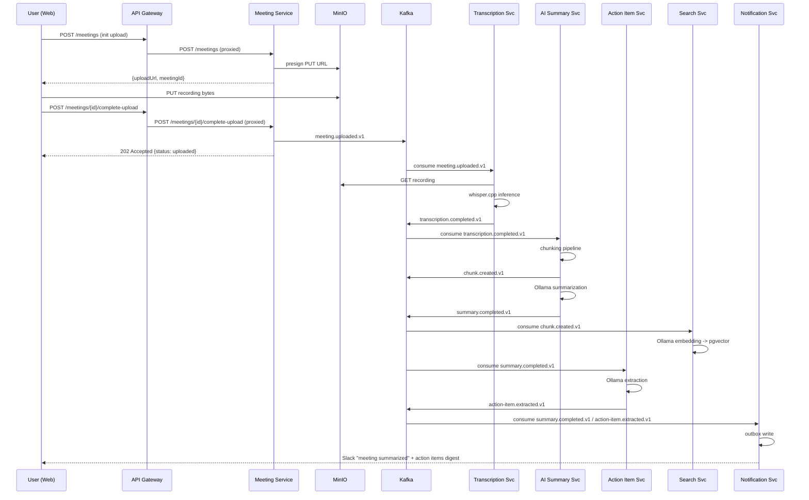
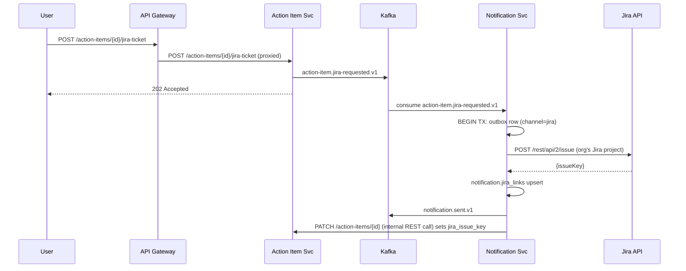
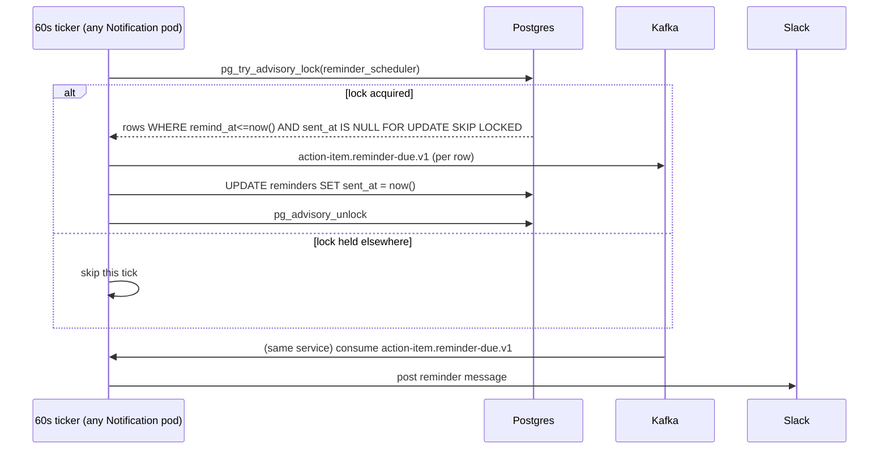

# Kafka Topic Design (KRaft mode)

Cluster: 3-broker KRaft (locally can run as 1 broker/1 controller combined
process to save RAM; document RF=3 for production). Deployed via the
**Strimzi** operator on Kubernetes. Message payloads are **plain JSON**,
hand-defined per topic (documented below) — no protobuf, no schema
registry. Each consumer unmarshals into its own Go struct for that topic;
adding a field is additive and backward-compatible as long as consumers
ignore unknown fields, which is the same discipline a schema registry
would enforce, just without the extra moving part.

## Naming & conventions

- Topic name: `<domain>.<event>.v<version>` (e.g. `meeting.uploaded.v1`).
- Partition key: `org_id` when cross-meeting ordering within a tenant matters
  for a consumer's business logic is *not* required (allows even spread);
  `meeting_id` when per-meeting ordering matters (e.g. status transitions
  must be applied in order). See table below for the actual key per topic.
- Every topic `X` has a companion `X.dlq` for messages that exhausted
  retries; DLQ consumer alerts via Prometheus (`dlq_message_count` metric).
- Consumer group name = service name (`transcription-service`,
  `ai-summary-service`, …) — one group per service, never shared, so each
  service's replay/rebalance is independent.
- Default retention: 7 days for operational topics, 30 days for
  `*.completed.v1` topics an ArgoCD-style event-sourced rebuild (Analytics
  Service) might want to replay further back — Analytics additionally
  persists its own checkpoint (`analytics.consumer_checkpoints`) so a full
  historical rebuild can also read from a compacted "meeting archive" topic
  if retention isn't enough (documented as a Phase 6 stretch: log-compacted
  `meeting.snapshot.v1`).

## Topic Catalog

| Topic | Producer | Consumers | Key | Partitions | Retention | Purpose |
|---|---|---|---|---|---|---|
| `user.registered.v1` | Auth Service | User Service | `user_id` | 6 | 7d | New account created |
| `user.role-changed.v1` | User Service | Analytics | `user_id` | 6 | 7d | RBAC audit trail |
| `org.created.v1` | Organization Service | — (future billing) | `org_id` | 3 | 7d | Tenant provisioned |
| `org.quota-exceeded.v1` | Organization Service | Notification | `org_id` | 3 | 7d | Usage cap hit |
| `meeting.uploaded.v1` | Meeting Service | Transcription Service | `meeting_id` | 12 | 7d | Kicks off pipeline |
| `meeting.status-changed.v1` | Meeting Service | Analytics, Notification | `meeting_id` | 12 | 30d | Status machine transitions |
| `meeting.deleted.v1` | Meeting Service | Transcription, AI Summary, Search, ActionItem (cascade cleanup) | `meeting_id` | 12 | 7d | GDPR-style deletion fan-out |
| `transcription.completed.v1` | Transcription Service | AI Summary, Action Item, Meeting Service | `meeting_id` | 12 | 30d | Transcript ready |
| `transcription.failed.v1` | Transcription Service | Notification, Meeting Service | `meeting_id` | 12 | 7d | ASR failure |
| `chunk.created.v1` | AI Summary Service | Search Service | `meeting_id` | 12 | 30d | Chunk batch ready to embed |
| `embedding.completed.v1` | Search Service | Analytics | `meeting_id` | 12 | 7d | Vectors indexed |
| `summary.completed.v1` | AI Summary Service | Meeting Service, Action Item, Notification, Analytics | `meeting_id` | 12 | 30d | Summary ready |
| `summary.failed.v1` | AI Summary Service | Notification | `meeting_id` | 12 | 7d | LLM failure |
| `action-item.extracted.v1` | Action Item Service | Meeting Service, Notification, Analytics | `meeting_id` | 12 | 30d | Batch of items extracted |
| `action-item.status-changed.v1` | Action Item Service | Analytics, Notification | `action_item_id` | 6 | 30d | Owner marks done/in-progress |
| `action-item.jira-requested.v1` | Action Item Service (via gateway) | Notification Service | `action_item_id` | 6 | 7d | User asked to file a Jira ticket |
| `action-item.reminder-due.v1` | Notification Service (scheduler) | Notification Service (dispatcher) | `action_item_id` | 6 | 1d | Reminder fired |
| `notification.sent.v1` | Notification Service | Analytics | `org_id` | 6 | 7d | Delivery audit |
| `notification.failed.v1` | Notification Service | (alerting only) | `org_id` | 6 | 7d | Delivery failure |

Every `*.completed.v1` / `*.extracted.v1` / `*.status-changed.v1` topic above
has a `.dlq` counterpart, e.g. `transcription.completed.v1.dlq`.

## Event Flow Diagrams

### 1. Upload → full processing pipeline



### 2. RAG Q&A across historical meetings

```mermaid
sequenceDiagram
    participant U as User
    participant GW as API Gateway
    participant SE as Search Service
    participant OL as Ollama (embed + chat)
    participant PG as Postgres (pgvector, RLS by org)

    U->>GW: POST /qa/ask {question}
    GW->>SE: POST /qa/ask (proxied, orgId from JWT)
    SE->>OL: embed(question)
    OL-->>SE: query_vector
    SE->>PG: SET LOCAL app.current_org; SELECT ... ORDER BY embedding <=> query_vector LIMIT k
    PG-->>SE: top-k chunks (+ meeting_id, timestamps)
    SE->>OL: chat(system=grounding prompt, context=chunks, question)
    OL-->>SE: answer text (cites chunk refs)
    SE->>PG: INSERT search.qa_history
    SE-->>GW: {answer, citations:[{meetingId, title, timestamp}]}
    GW-->>U: 200 OK
```

### 3. Jira ticket creation from an action item



### 4. Reminder scheduler



## Delivery Semantics & Reliability

- **At-least-once** end-to-end; every consumer handler is written to be
  **idempotent** (upsert by natural key, e.g. `chunk_id` for embeddings,
  `(action_item_id, remind_at)` for reminders) so duplicate delivery is safe.
- **Retry policy**: exponential backoff (3 attempts) in-consumer for
  transient errors (Ollama timeout, MinIO hiccup); on exhaustion, publish to
  the topic's `.dlq` with the original headers + `x-error-reason`, `x-retry-count`.
- **Trace propagation**: `traceparent` (W3C) set as a Kafka message header at
  produce time (from the OTel context), extracted by the consumer to
  continue the same distributed trace across the async boundary.
- **Ordering**: partitioning by `meeting_id` guarantees the meeting's own
  event sequence (`uploaded → transcribed → summarized → extracted`) is
  processed in order *for that meeting*, while different meetings parallelize
  freely across partitions.
